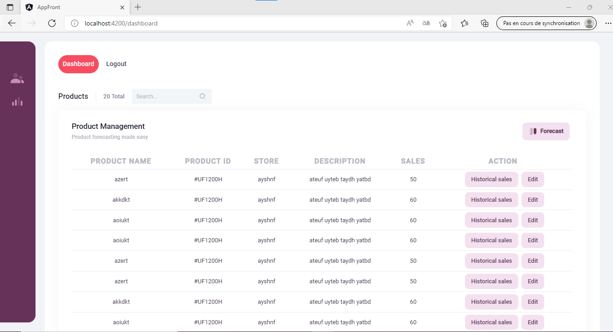

# Sales Forecasting application
Developing a web application that helps predict future sales for fashion retailers. 
This project consists of :

   * Application UI : the user interface that allows interaction with the forecasting application, generated with [Angular CLI](https://github.com/angular/angular-cli).  
   * Security Microservice : ensure the authentication and the authorization, generated with [NodeJs/ExpressJs](https://nodejs.org/en/).  
   * Forecasting Microservice : implements sales prediction (a simple display without using an AI model) , generated with [NodeJs/ExpressJs](https://nodejs.org/en/) .  
   * Api Gateway : is the single entry point for all clients, it handles requests that are simply routed to the appropriate service, generated with [NodeJs/ExpressJs](https://nodejs.org/en/) .  

## Architecture choice
Microservice architecture.
  
  

## Use cases implemented 
 <ol>
 <li><b>Register to the platform  : </b>   

   

 </li>
 <li><b>Sign in : </b>  

  
  </li>
 <li><b>Consult product dashboard : </b>  

  
  </li>
 <li><b>Forecasting sales for a specific product and store : </b>  

  

Result :  
  
  </li>
  </ol>
